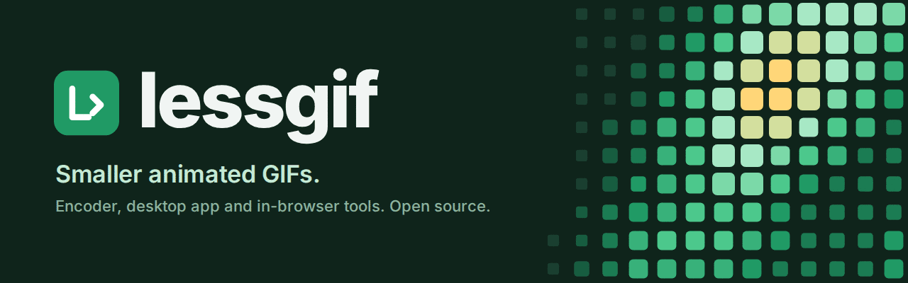
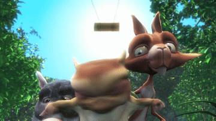
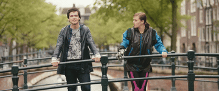
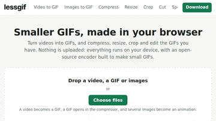
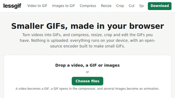

<p align="center">
  
  <br><sub>This banner is itself a GIF made by lessgif: 1280×400, 32 frames, 191 KB.</sub>
</p>

# lessgif

An animated GIF encoder that makes GIFs about **half the size of gifski's at the same
SSIMULACRA2 score**, a perceptual quality metric. It turns videos into GIFs and re-compresses
existing GIFs, as a command-line tool, a Rust library, and a 68 KB WebAssembly build that runs
in the browser.

| | result |
|---|---|
| Video to GIF, 363 film clips, vs gifski 1.34 | **50% smaller** (median) at equal SSIMULACRA2 70; smaller on every clip |
| Re-compressing 281 GIFs, vs gifsicle 1.94 `-O3 --lossy=35` | **40% smaller** at equal SSIMULACRA2 |
| Near-lossless re-compression (SSIMULACRA2 90), vs gifsicle `--lossy` | 12–16% smaller (two GIF sets) |
| Lossless (quality 100) | all 281 test GIFs reproduced exactly; 0.3% bigger than gifsicle `-O3` (median) |
| Speed at SSIMULACRA2 70, 3 s clip at 15 fps | 1.45 s on one thread; gifski 1.86 s, using 3.5 s of CPU across its threads |
| Browser build | 68 KB gzipped, byte-identical output to the native build |

The video benchmark can be reproduced with the scripts in [`bench/`](bench/). Read the
[caveats](#caveats) before quoting these numbers.

## See for yourself

Each row is the same 3-second clip, 360 pixels wide at 15 fps, made into a GIF by ffmpeg 6.1 (its
usual `palettegen` and `paletteuse` recipe) and gifski 1.34 at their default settings, and by
lessgif at the lowest quality whose GIF scores at least as high as the better of the two. The
score is SSIMULACRA2 against the source frames (higher is better), so no lessgif GIF here is a
lower-quality copy. Up close, lessgif's GIFs show a little more fine grain in flat areas; judge
the trade for yourself. [`bench/showcase.py`](bench/showcase.py) makes them all again.

<!-- showcase -->

#### Cartoon: Big Buck Bunny

| ffmpeg | gifski | lessgif |
|---|---|---|
|  |  |  |
| 1,181 KB, score 76.5 | 824 KB, score 76.0 | **490 KB**, score 76.6<br>41% smaller than gifski,<br>59% smaller than ffmpeg |

#### Live action: Tears of Steel

| ffmpeg | gifski | lessgif |
|---|---|---|
|  |  |  |
| 1,461 KB, score 83.8 | 671 KB, score 78.7 | **403 KB**, score 83.9<br>40% smaller than gifski,<br>72% smaller than ffmpeg |

#### Screen recording: this project's website

| ffmpeg | gifski | lessgif |
|---|---|---|
|  |  |  |
| 663 KB, score 92.8 | 529 KB, score 81.6 | **437 KB**, score 92.8<br>17% smaller than gifski,<br>34% smaller than ffmpeg |

#### Re-compressing a GIF: ffmpeg's GIF from the first row, scored against itself

| input (ffmpeg) | gifsicle `-O3 --lossy=35` | lessgif |
|---|---|---|
|  |  |  |
| 1,181 KB | 936 KB, score 75.4 | **508 KB**, score 76.2<br>46% smaller than gifsicle |

<!-- /showcase -->

Big Buck Bunny © 2008 Blender Foundation, [bigbuckbunny.org](https://peach.blender.org); Tears of
Steel © 2012 Blender Foundation, [mango.blender.org](https://mango.blender.org); both CC BY 3.0.

## How it works

A GIF encoder normally runs separate stages: pick a palette and dither, mark unchanged pixels
transparent, then (in "lossy" GIF tools) bend pixels so LZW compresses them better. Each stage
adds its error on top of the previous one's.

lessgif makes all of that one decision per pixel, always measured against the *source* colour.
For each pixel it compares three choices:

- **extend the current LZW string**, which costs almost nothing, if the colour that comes next
  in the string is close enough;
- **keep what the previous frame shows**, through the transparent index;
- **start a new code** with the nearest palette colour.

Whatever it picks, the remaining error is diffused to the neighbouring pixels, so the local
average colour stays right. How much error a cheap choice may add depends on where the pixel
is:

- **Texture masking.** Busy areas get up to 8 times more error than smooth ones, because noise
  that hides in foliage shows on a clear sky. Bright areas get somewhat more than dark ones.
- **Eye-model distance.** Errors are measured in a perceptual colour space (close to the XYB
  space that SSIMULACRA2 and JPEG XL use), so brightness counts more than hue.
- **Palette.** k-means weighted towards pixels the palette serves badly, plus a share of
  entries reserved for the clip's most outlying colours.

Frames stream through the encoder, so memory stays at a few frame buffers however long the
clip is. Large frames can be split into bands that encode on separate threads.

## Install and use

Ready-made apps for Windows, macOS and Linux are on the [releases page](../../releases/latest).
Or build it yourself:

```sh
cargo install --path .        # from a checkout; needs Rust 1.88 or newer
lessgif input.mp4 out.gif --quality 70
```

Video input is read through [ffmpeg](https://ffmpeg.org), which must be on the `PATH`. GIFs
and folders of PNG frames are read directly.

```text
lessgif <input> <out.gif> [options]

  --quality Q      0-100, higher is better and bigger. 100 is lossless when each frame fits in
                   255 colours. Without it: --lambda 60 --tbias 150, similar to quality 65
  --max-size N     find the best quality that fits N bytes (suffix k or M, e.g. 256k); shrinks the
                   frames only if even the lowest quality doesn't fit
  --fps F          frame rate for video and PNG input (default 15; GIF input keeps its timing)
  --max-side S     scale video so its longest side is at most S pixels (default 480)
  --colors N       palette size, at most 255 (default 255)
  --dither D       error diffusion strength 0-1 (default 0.75)
  --threads N      encode each frame in N horizontal bands in parallel (default: all cores)
  --loop L         forever (or 0), once, or a number of repeats after the first play (default:
                   forever, or what a GIF input has)
```

Rough guide to `--quality` on video: 35 gives about SSIMULACRA2 50 (medium), 62 about 70 (high),
and 90 is near-lossless.

### As a Rust library

The encoder itself has no dependencies; turn off the default `cli` feature to drop the ones the
command-line tool needs (`lessgif = { version = "0.1", default-features = false }`).

```rust
use lessgif::{Encoder, PaletteBuilder, Params, params_for_quality};

let p = params_for_quality(70.0, &Params::default());
// pass 1: the palette (PaletteBuilder keeps a small sample, so memory doesn't grow)
let mut pb = PaletteBuilder::new();
for f in &frames {
    pb.add(f, w, h); // RGBA, w * h * 4 bytes; alpha below 128 is transparent
}
// pass 2: encode
let out = std::io::BufWriter::new(std::fs::File::create("out.gif")?);
let mut enc = Encoder::new(out, w, h, pb.palette_for(&p), p, pb.has_clear)?;
for f in &frames {
    enc.push(f, 7)?; // delay in centiseconds
}
enc.finish()?;
```

`SizeSearch` drives the `--max-size` search if you need a size budget.

### In the browser

```sh
rustup target add wasm32-unknown-unknown
sh web/build.sh                     # builds web/lessgif.wasm
python3 -m http.server -d web       # then open http://localhost:8000
```

`web/index.html` is a small demo that turns a video or GIF into a GIF without uploading it.
`web/lessgif.js` is the wrapper to use in your own page or worker:

```js
import { loadLessGif, delaysForFps } from './lessgif.js';
const encoder = await loadLessGif();
const { gif } = encoder.encode({ w, h, n, getFrame: (i) => frames[i], delays: delaysForFps(n, 15), quality: 70 });
```

`encode` also takes `loop` (0 forever, -1 play once), `colors`, `dither` and an `onProgress`
callback, and `encoder.sizeSearch(bytes)` runs the same size-budget search as `--max-size`.
The WebAssembly build is single-threaded; run it in a worker. Its output is byte-identical to
the native build at the same settings, which CI checks. Each release also has the two files
ready to use as `lessgif-wasm.zip`.

## Website

[`site/`](site/) is a complete GIF tool website built on the WebAssembly encoder: video to GIF,
images to GIF, compress, resize, crop, cut, speed, reverse, rotate, add text, split into frames
and GIF to MP4, all running in the visitor's browser. It is plain HTML, CSS and JavaScript with no framework and no server code.
See [`site/README.md`](site/README.md) for building, testing and hosting it.

## Benchmark

**Video to GIF.** 363 three-second clips at 15 fps, scaled to at most 400 px: 300 from the
Blender open movies *Tears of Steel* and *Big Buck Bunny*, 15 from the *Sintel* trailer, and
48 from Xiph.org's standard test sequences. Each clip was encoded by lessgif at 9 settings and
by gifski 1.34 at 11 quality levels, every GIF was decoded and scored with SSIMULACRA2 against
the source frames, and the size each encoder needs for a given score was interpolated on that
clip's curve. lessgif ran with `--threads 1` and gifski with `RAYON_NUM_THREADS=1`.

| SSIMULACRA2 | lessgif smaller than gifski (median) | clips where lessgif is smaller |
|---|---|---|
| 50 (medium) | 49.8% | 99% |
| 60 | 49.8% | 100% |
| 70 (high) | 50.1% | 100% |
| 80 | 46.6% | 100% |

- At equal DSSIM, a second metric, lessgif is 47.7% smaller.
- By source at 70: Big Buck Bunny 52%, Tears of Steel 50%, Sintel 56%, Xiph sequences 46%.
- None of lessgif's encodes has a frame scoring below 0; 3.6% of gifski's do.
- A test oracle checks that the decoded GIF shows exactly the frames the encoder intended: all
  3,267 lessgif encodes passed.
- Speed, timed separately on 40 of the clips at about SSIMULACRA2 70 (lessgif `--quality 62`,
  gifski `--quality 88`), one encode at a time: lessgif took a median 1.45 s on one thread;
  gifski took 1.86 s and 3.5 s of CPU time, because it runs its stages on several threads.

To reproduce: `sh bench/fetch.sh` (1.6 GB of source video), then `bench/compare.py extract`,
`run` and `report`. See [`bench/README.md`](bench/README.md).

**Re-compressing GIFs.** 281 GIFs made from the same footage (by gifski and by ffmpeg with two
palette modes) plus generated stickers, memes and screen recordings, re-compressed by lessgif
and by gifsicle 1.94. At the quality gifsicle `-O3 --lossy=35` reaches, lessgif's files are a
median 40.5% smaller; at SSIMULACRA2 90, 11.6% smaller. This GIF set is not included in the
repository.

**Correctness.** 5,000 randomly generated inputs (sizes, frame counts, transparency, timings)
decode pixel-exactly in Pillow, ffmpeg and Chromium. `cargo test` runs the same check on
synthetic clips through the `image` crate's decoder.

## Caveats

- **More grain up close.** At the same SSIMULACRA2 score, lessgif's output has more fine dither
  grain in flat areas (sky, walls) when zoomed in 2x; gifski's looks smoother there. At normal
  size they look alike. SSIMULACRA2 forgives fine grain more than blur, and lessgif leans on
  that; at equal DSSIM the saving is 47.7% instead of 50%. No blind viewing test has been done
  yet, so "same score" is not yet "people can't tell them apart".
- **The test material is film.** Clips from open movies and standard test sequences, and GIFs
  generated from them. Phone videos, screen captures and GIFs found on the web may behave
  differently.
- **Lossless can be bigger than the input.** Re-encoding a GIF at quality 100 reproduces it
  exactly (all 281 test GIFs did), but for about a third of them the result was slightly larger
  than the original, so a tool built on lessgif should keep the original when it is smaller. Quality 100 is lossless
  only where each frame's changed pixels fit in 255 colours.
- **One encoder, one design.** lessgif is close to the limit of its single-pass design; the last
  ideas tried each gained under half a percent.

## License

Licensed under either of [Apache License, Version 2.0](LICENSE-APACHE) or
[MIT license](LICENSE-MIT) at your option.

Unless you explicitly state otherwise, any contribution intentionally submitted for inclusion
in this crate by you, as defined in the Apache-2.0 license, shall be dual licensed as above,
without any additional terms or conditions.
